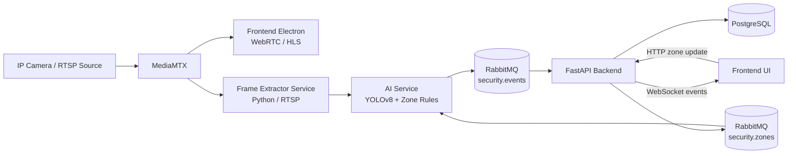

# Архітектура системи відеомоніторингу

## Загальна схема



## Блок 1. Маршрутизація відео та MediaMTX

`MediaMTX` виступає центральним хабом для відеопотоків.

Потік даних:

1. Камери публікують відео по `RTSP` у `MediaMTX`.
2. `Frontend` підключається до `MediaMTX` через `WebRTC` або `HLS` і показує відео користувачу з мінімальною затримкою.
3. `Frame Extractor Service` підключається до RTSP-потоку з `MediaMTX`, витягує кадри з потрібною частотою, наприклад `5 FPS`, і передає їх далі в AI-обробку.

Призначення блоку:

- розділити доставку відео та AI-обробку;
- дати кільком споживачам доступ до одного потоку;
- зменшити зв'язність між камерами, UI та сервісами аналітики.

## Блок 2. Обробка кадрів та штучний інтелект

`Frame Extractor Service` передає підготовлений кадр в `AI Service`.

Всередині `AI Service` виконується такий ланцюг:

1. `YOLOv8` знаходить об'єкти на кадрі.
2. Сервіс отримує координати bounding boxes.
3. Координати одразу звіряються з актуальними зонами детекції, які зберігаються в оперативній пам'яті сервісу.
4. Якщо виявлено порушення, наприклад людина увійшла в заборонену зону, формується подія безпеки.
5. `AI Service` публікує JSON-повідомлення в `RabbitMQ`, наприклад у `security.events` або `events_queue`.

Типовий склад повідомлення:

```json
{
  "camera_id": "cam-01",
  "event_type": "zone_intrusion",
  "object_class": "person",
  "bbox": {
    "x1": 0.21,
    "y1": 0.34,
    "x2": 0.42,
    "y2": 0.88
  },
  "timestamp": "2026-04-01T16:00:00Z"
}
```

Призначення блоку:

- відокремити AI-аналітику від бекенду;
- обробляти події асинхронно;
- забезпечити масштабування AI-сервісу незалежно від UI та API.

## Блок 3. Бекенд, база даних та WebSockets

`FastAPI Backend` виконує роль споживача подій і API-шару.

Потік даних:

1. Фоновий consumer у `FastAPI` слухає чергу подій у `RabbitMQ`.
2. Після отримання повідомлення бекенд валідує структуру події.
3. Подія зберігається в `PostgreSQL` разом із часом, камерою та метаданими.
4. Після збереження ця ж подія одразу відправляється у `Frontend UI` через активне `WebSocket`-з'єднання.

Результат для користувача:

- інтерфейс миттєво підсвічує тривогу;
- оновлюється журнал подій;
- реакція UI не залежить від циклу опитування REST API.

## Блок 4. Оновлення налаштувань зон

Оновлення зон має працювати без перезапуску AI-сервісу.

Послідовність:

1. Користувач малює або змінює зону на `Frontend`.
2. `Frontend` відправляє HTTP-запит з новими координатами у `FastAPI Backend`.
3. `FastAPI` зберігає зміни в `PostgreSQL`.
4. Після цього бекенд публікує JSON-повідомлення в керуючу чергу `RabbitMQ`, наприклад у `security.zones` або `config_updates`.
5. `AI Service` слухає цю чергу та оновлює конфігурацію зон у своїй пам'яті на льоту.

Це дає такі властивості:

- зміни зон застосовуються майже миттєво;
- не потрібен рестарт сервісу аналітики;
- правила детекції залишаються узгодженими між UI, БД та AI.

## Ролі компонентів

- `MediaMTX`: єдина точка прийому та роздачі відеопотоків.
- `Frontend Electron`: перегляд відео, керування камерами, малювання зон, відображення подій.
- `Frame Extractor Service`: відбір кадрів із потоку з контрольованою частотою.
- `AI Service`: детекція об'єктів, перевірка зон, генерація подій.
- `RabbitMQ`: транспорт подій і конфігураційних оновлень між сервісами.
- `FastAPI Backend`: API, валідація, збереження подій, WebSocket-розсилка.
- `PostgreSQL`: постійне зберігання зон, подій і службових даних.

## Ключові переваги такої архітектури

- слабка зв'язність між сервісами;
- масштабованість AI і backend окремо;
- низька затримка для UI;
- стійкість до тимчасових затримок між сервісами через використання черг;
- можливість динамічно змінювати зони детекції без простою системи.
